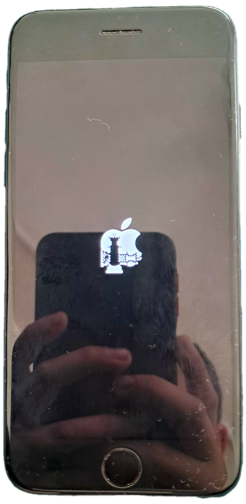

## 🌐 Add Repo Manually

Please copy the URL below and add it manually to your preferred package manager (Sileo, Zebra, Cydia, Installer, etc.):

```text
https://haydarreiss31.github.io/HaydarReissRepo/


---

## ♟️ Custom Respring Animation

<table border="0">
  <tr>
    <td width="40%" align="center" valign="top">
      
    </td>
    <td width="60%" valign="top" style="padding-left: 20px;">
      <h3>🛠️ Installation Guide</h3>
      <ol>
        <li><b>Add the Source:</b> Copy the repo link above and add it to your package manager (Sileo, Zebra, etc.).</li>
        <li><b>Install the Package:</b> Search for the respring theme inside the repository and install it.</li>
        <li><b>Enable the Theme:</b> Open your theme engine (like <b>SnowBoard</b> or <b>Anemone</b>), go to the <i>Respring Logo</i> extension, and enable this theme.</li>
        <li><b>Respring:</b> Apply changes and perform a respring. Enjoy your new custom chess-themed boot logo!</li>
      </ol>
    </td>
  </tr>
</table>
